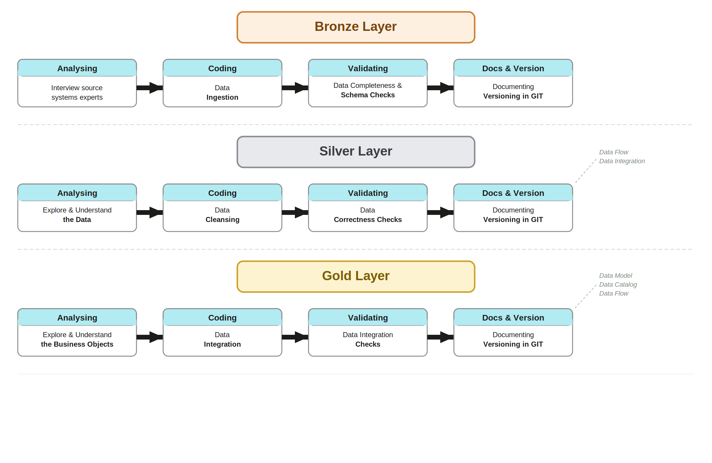

# data-warehouse-sql-project-

> End-to-end data warehouse built with MySQL using Medallion Architecture
> (Bronze → Silver → Gold), covering ETL pipelines, data modeling, and 
> analytical reporting.

---

## 🏗️ Architecture

The project follows **Medallion Architecture** with three distinct layers:

- **Bronze Layer** — Raw data ingested as-is from source systems (ERP & CRM)
- **Silver Layer** — Cleansed, standardized, and normalized data
- **Gold Layer** — Business-ready star schema optimized for analytics

---

## 📖 Project Overview

This project simulates a real-world data warehouse workflow, covering:

1. **Data Architecture** — Designing a modern warehouse using Medallion Architecture
2. **ETL Pipelines** — Extracting, transforming, and loading data across layers
3. **Data Modeling** — Building fact and dimension tables in a star schema
4. **Analytics & Reporting** — SQL-based insights on customer, product, and sales data

---

## 🛠️ Tech Stack

| Tool | Purpose |
|------|---------|
| MySQL | Database engine |
| DBeaver | SQL client & database management |
| Git / GitHub | Version control |
| Draw.io | Architecture diagrams |

> **Note:** This project uses MySQL instead of SQL Server.
> Since MySQL does not support schemas the same way SQL Server does,
> three separate databases are used (bronze, silver, gold) to achieve
> the same logical layer separation.

---

## 🚀 Build Progress

### 🥉 Bronze Layer — ✅ Complete

Ingested raw data from two source systems into the warehouse with no transformations.

- Built 6 raw tables — 3 from CRM, 3 from ERP — mirroring source CSV structure exactly
- Used `TRUNCATE → LOAD DATA LOCAL INFILE` pattern for full, repeatable loads
- Validated row counts and column positions after each load
- Adapted from SQL Server (`BULK INSERT`) to MySQL (`LOAD DATA LOCAL INFILE`)

### 🥈 Silver Layer — ✅ Complete

Cleansed and standardized the raw bronze data, making it reliable and consistent.

- Applied data type standardization across all tables (e.g. date integers → proper DATE values)
- Fixed data quality issues — nulls, invalid values, inconsistent codes (gender, marital status, country)
- Removed duplicate records 
- Loaded clean results into the silver layer tables

### 🥇 Gold Layer — 🔄 In Progress

Building the business-ready star schema for analytics and reporting.

